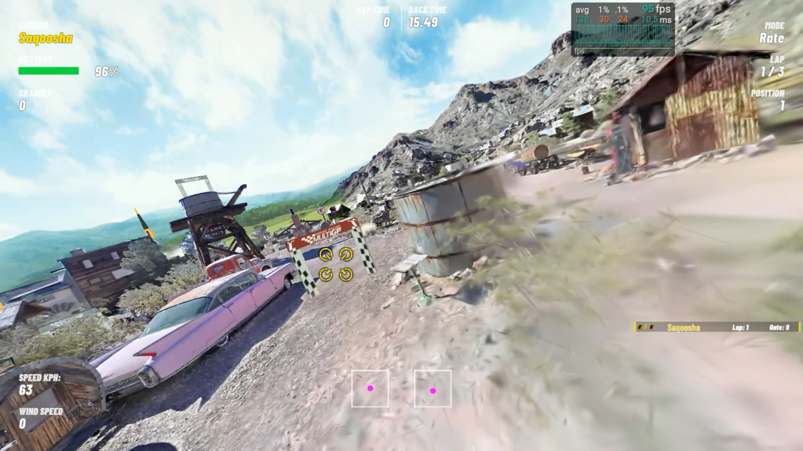

# VDGS

*[日本語版](README.ja.md)*

A mod that renders 3D Gaussian Splatting captures inside VelociDrone — so you can fly a
real, scanned place in an FPV drone simulator.

[](https://www.youtube.com/watch?v=MuDq_7X-4Mo)

[Watch the flight](https://www.youtube.com/watch?v=MuDq_7X-4Mo)

## What it does

| | |
|---|---|
| Largest capture flown | **3,177,554 splats** (drjohnson), or 1.17M across three scenes at once |
| Frame time | **9.0 ms** at 3.18M splats — RTX 3060, drone's eye view, 120° field of view |
| Depth | Correct against gates and the aircraft; alpha blending holds up |

Palette-free SH packing and frustum culling took that from 13.3 ms to 9.0 ms, **neither of
them costing image quality**. The breakdown is in [docs/performance.md](docs/performance.md).

## How it works

```
drop <game>/vdgs/foo.ply  →  the plugin reads it at load time and renders it
                             ↑ drive it from a browser at http://<host>:8777/
```

No external tools. A 2.17M-splat capture parses in under a second and is on screen in
about three; a four-million-splat capture with spherical harmonics takes thirteen, so show
a scene before you fly rather than during. Pre-converted scenes (five binaries plus
`meta.json`) still work if you have them.

The plugin polls the loaded track name once a second and shows or hides captures according
to `bindings.json`, so a scene appears on the tracks you bound it to and nowhere else.

Rendering is a port of [aras-p/UnityGaussianSplatting](https://github.com/aras-p/UnityGaussianSplatting)
(MIT), stripped of editing, the URP/HDRP paths and the Burst dependency so it runs inside
an injected plugin.

## Documentation

| | |
|---|---|
| [docs/USAGE.md](docs/USAGE.md) | Install, launch, control it |
| [docs/SCENES.md](docs/SCENES.md) | Bring a `.ply`, orient it, bake a collision mesh |
| [docs/TRACKS.md](docs/TRACKS.md) | Lay a course over a capture and get it shippable |
| [docs/distribution.md](docs/distribution.md) | The companion app, the release run, the hosting |
| [docs/ARCHITECTURE.md](docs/ARCHITECTURE.md) | Internals, and why the design is what it is |
| [docs/ply-loading.md](docs/ply-loading.md) | Reading .ply at load time, and its traps |
| [docs/performance.md](docs/performance.md) | Where the frame time goes, and what moves it |
| [docs/verification.md](docs/verification.md) | Checking the render with numbers, not eyes |
| [docs/alignment.md](docs/alignment.md) | Orienting a capture, and the mirror everyone hits |
| [AGENTS.md](AGENTS.md) | Measured traps (Japanese). No machine-specific paths |

## Requirements

- VelociDrone, built on Unity 2021.3.45f2
- **A D3D12-capable GPU.** Sorting splats needs Shader Model 6 wave intrinsics, so DX11
  will not do. Launch the game with `-force-d3d12`
- BepInEx 5.4.23.5 (win_x64)

Building the mod additionally needs Unity 2021.3.45f2 **on Windows** for the shader bundle —
macOS cannot compile D3D shaders. Adding a capture needs nothing: drop the `.ply` in.

## Please do not

**Use this on leaderboards or in multiplayer.** VelociDrone ships
`ACTk.Runtime.dll` (Anti-Cheat Toolkit), and submitting times from a modified client is
against its terms. Local flying only.

## Scene data is not included

**The mod ships no captures.** The only splat data in this repository is what
`tools/make_test_ply.py` generates — a synthetic scene for checking axes, colour and
scale. Everything flown during development belongs to someone else: the academic datasets
state no licence at all (which means all rights reserved, not "free"), the INRIA 3DGS
licence is research-only and carries that restriction to derivative works, and the rest
are third-party captures published on SuperSplat.

Bring your own `.ply` and drop it in `<game>/vdgs/`. Collision meshes are optional and
baked locally — [docs/SCENES.md](docs/SCENES.md).

## Licence

The project is [MIT](LICENSE). `src/VDGS/GpuSorting.cs` and
`unity/VDGSBundler/Assets/VDGS/Shaders/` additionally derive from
[aras-p/UnityGaussianSplatting](https://github.com/aras-p/UnityGaussianSplatting) (MIT).
The GPU sort in turn derives from [b0nes164/GPUSorting](https://github.com/b0nes164/GPUSorting)
(MIT, Thomas Smith).
